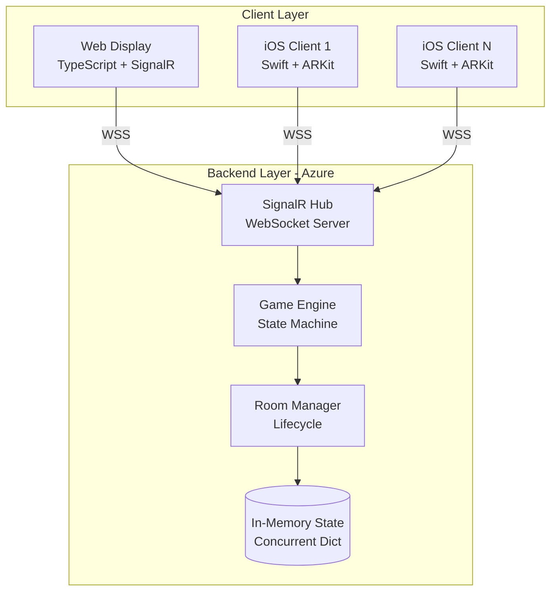
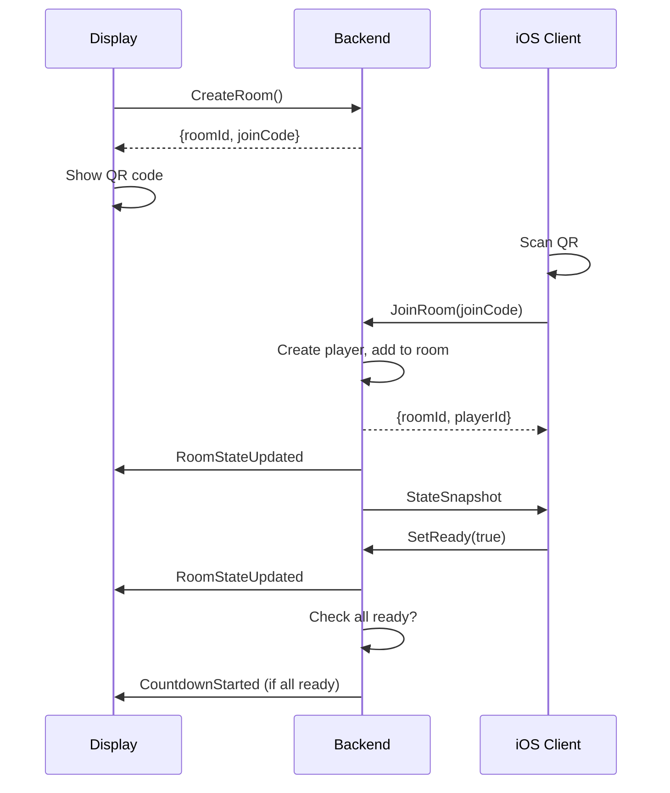
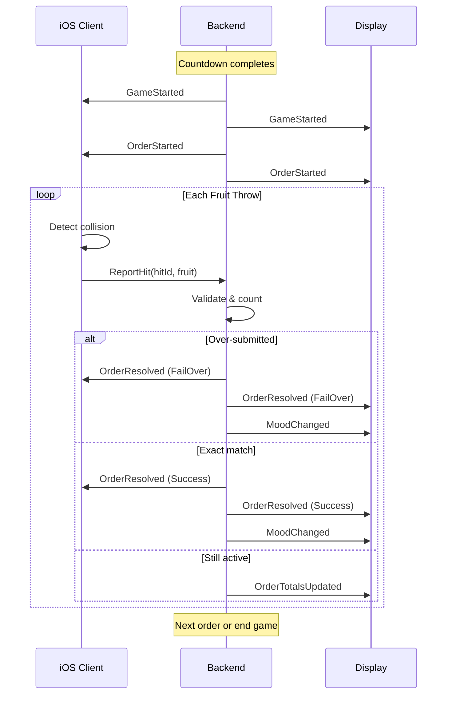
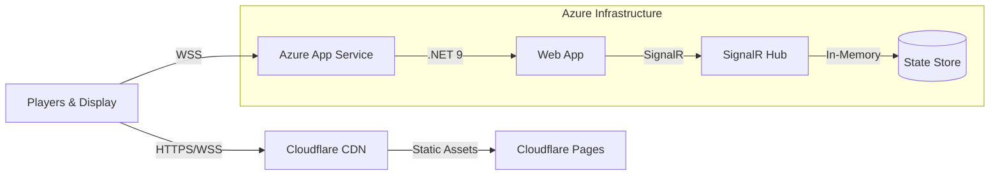

# Oh My Hungry God - System Architecture

Technical architecture overview for the multiplayer AR game.

## High-Level Architecture

## Technology Stack

### Backend
- **.NET 9**: Latest C# runtime
- **ASP.NET Core**: Web framework with Minimal APIs
- **SignalR**: Real-time WebSocket communication
- **Azure App Service**: Hosting platform
- **In-Memory Storage**: ConcurrentDictionary for thread-safe state

### Frontend (Host Display)
- **TypeScript**: Type-safe JavaScript
- **Vite**: Fast build tool and dev server
- **Vanilla JS**: No framework overhead
- **SignalR Client**: JavaScript WebSocket client
- **Cloudflare Pages**: Global CDN hosting

### iOS (Mobile Controllers)
- **Swift**: Native iOS development
- **ARKit**: Image tracking and AR features
- **RealityKit**: Physics simulation and 3D rendering
- **SignalRClient-Swift**: SignalR client library
- **SwiftUI**: UI framework

## Component Details

### 1. Backend (.NET 9)

#### SignalR Hub (GameHub.cs)

Central communication hub for all clients.

**Client → Server Methods:**
- `CreateRoom()` - Display creates a new game room
- `JoinRoom(joinCode, playerName)` - Player joins with 6-character code and name
- `SetReady(roomId, ready)` - Player marks ready/not ready
- `ReportHit(roomId, hitId, fruitType)` - Player hit the mouth (tracks per-player stats)
- `Ping(roomId)` - Keep-alive heartbeat

**Server → Client Events:**
- `RoomStateUpdated` - Player joins/leaves/ready changes (includes names)
- `CountdownStarted` - 6s countdown begins
- `GameStarted` - Game has started
- `OrderStarted` - New order with requirements
- `OrderTotalsUpdated` - Hit counted (live updates, triggers particle effects)
- `OrderResolved` - Order success/fail
- `MoodChanged` - God's mood changed (triggers transitions)
- `GameFinished` - All 10 orders complete (includes player stats)
- `StateSnapshot` - Full state sync (on join/reconnect)

#### Game Engine Service

Authoritative game logic and state machine.

**Responsibilities:**
- State transitions (Welcome → Lobby → Countdown → InGame → Results)
- Order resolution (immediate fail/success rules)
- Mood calculation
- Timer management
- Event broadcasting

**Key Methods:**
- `StartCountdown()` - Begin 6s countdown when all ready
- `ProcessHit(playerId)` - Validate and count fruit hits, track per-player
- `ResolveOrder()` - Determine success/fail, update mood (no burnout game over)
- `EndGame()` - Transition to results with player statistics

#### Room Service

Room lifecycle management.

**Responsibilities:**
- Create rooms with unique join codes
- Add/remove players
- Track player connections
- Clean up inactive rooms

**Room Lifecycle:**
- Created when display connects
- Persists while players connected
- Destroyed after 5 min inactivity or 30s post-results

#### Background Timer Service

Hosted background service for server-side timers.

**Tasks (runs every 1 second):**
- Check countdown timers (6s)
- Check order timeouts (10s)  
- Clean up inactive rooms

### 2. Frontend (TypeScript)

#### SignalR Client Wrapper

Manages WebSocket connection and event handling.

**Features:**
- Auto-reconnect on disconnect
- Event bus pattern for UI updates
- Type-safe event signatures

#### Screen Components

**WelcomeScreen:**
- Displays large logo
- Generates QR code with join link
- Displays 6-character join code
- About link to Global Game Jam
- Shown during Welcome state

**LobbyScreen:**
- Lists connected players by name
- Shows ready status for each
- Displays "Starting soon..." when all ready

**CountdownScreen:**
- 6-second countdown animation
- Dark overlay for better contrast

**GameScreen:**
- Current order display with fruit requirements
- Circular arc countdown timer (SVG-based)
- Live fruit count updates with emoji highlights
- Particle splash effects on hits
- Progress bar (orders 1-10)
- God mood indicator

**ResultsScreen:**
- Plays mood-based ending video once (victory/neutral/angry/defeat)
- Team stars (0-3) based on final mood
- Final stats (orders completed, successes, failures, success rate)
- Per-player statistics table (name, hits, contribution %)
- Restart button

#### Mood Video Manager

Controls background video based on god's mood with smooth transitions.

**Videos:**
- **Moods**: `neutral.webm`, `happy.webm`, `angry.webm` (looping)
- **Chewing**: Mood-specific eating animations (play on hits)
- **Transitions**: Smooth crossfades between moods
- **Endings**: `victory.webm`, `neutral_ending.webm`, `angry_ending.webm`, `defeat.webm`
- **Lobby**: `waiting.webm` for pre-game

Automatically switches videos when MoodChanged event received, plays chewing on OrderTotalsUpdated.

### 3. iOS App (Swift)

#### SignalR Client

Swift wrapper for SignalRClient-Swift library.

**Features:**
- Connection state tracking
- Event handler callbacks
- Async/await API for server methods
- Type-safe event models

#### AR Components

**FruitEntity:**
- 2D sprite billboarded to camera
- Physics-enabled (RealityKit)
- Two sizes: thumbnail (4cm) and full (varies by fruit)
- Expand on throw, reset on respawn

**MouthGateEntity:**
- Invisible collision trigger at mask mouth position
- Detects fruit hits
- Positioned relative to AR image anchor

**FruitSpawner:**
- Spawns one entity per fruit type
- Randomizes fruit order for each new order
- Updates positions to follow camera (panel at bottom)
- Handles respawning after throw (plays miss sound)

**SoundManager:**
- Loads and plays sound effects
- Touch, throw, hit, and miss sounds
- Uses AVAudioPlayer for playback

**ThrowGestureHandler:**
- Converts swipe gesture to 3D velocity
- Triggers fruit expansion and physics activation

#### Multiplayer UI

**WelcomeView:**
- How To Play expandable guide
- Share button for host URL
- About button for GGJ info

**AboutView:**
- Game information
- GGJ 2026 Mauritius credits
- Technology stack
- Link to jam site

**LobbyView:**
- Join code input with QR scanner button
- Player name submission
- Ready toggle
- Connection status indicator
- Transitions to AR game when countdown starts

**OrderOverlayView:**
- Shows current order in AR view
- Fruit requirements with progress
- Timer countdown
- Styled for AR overlay

#### Game Manager

Coordinates AR gameplay and network integration.

**Modes:**
- **Single-player**: Local scoring only
- **Multiplayer**: Reports hits to server, shows network orders

**Collision Detection:**
- Listens for fruit-gate collisions
- In multiplayer: sends `ReportHit` to server with player ID
- In single-player: increments local counters
- Plays hit sound on successful collision

**Game Over Handling:**
- Displays game results overlay
- Shows restart button
- Resets state for new game

## Data Flow

### Room Join Flow

### Gameplay Flow

## State Management

### Backend State

**In-Memory Store:**
- `ConcurrentDictionary<Guid, Room>` - All active rooms
- `ConcurrentDictionary<string, Guid>` - Join code → Room ID
- `ConcurrentDictionary<Guid, HashSet<Guid>>` - Processed hit IDs
- Player names and hit counts tracked in Player model

**Thread Safety:**
- All dictionaries use concurrent collections
- State updates are atomic
- Background timer service uses scoped services

### Frontend State

**GameState class:**
- Current screen
- Room ID and join code
- Player list with names
- Current order
- Submitted counts
- Timer
- Player statistics array

**Reactive:**
- State changes trigger UI re-renders
- Event-driven updates via SignalR

### iOS State

**GameManager:**
- AR state (tracking, entities)
- Network state (if multiplayer enabled)
- Current order overlay data

**Published properties** trigger SwiftUI updates.

## Network Protocol

### Transport
- **Primary**: WebSockets (binary)
- **Fallback**: Server-Sent Events → Long Polling
- **SignalR handles negotiation automatically**

### Message Format
- **JSON** over WebSocket
- **Hub Protocol**: SignalR JSON protocol v1

### Idempotency
- Each hit has unique GUID (hitId)
- Server tracks processed hits per room
- Prevents duplicate scoring from network retries

### Reconnection
- SignalR auto-reconnect with exponential backoff
- Display: requests StateSnapshot on reconnect
- iOS: marked as disconnected but stays in room

## Security Model

### Authentication
- **None** (by design for game jam)
- GUID-based identifiers prevent collisions

### Authorization
- Server validates:
  - Player is in room
  - Game state is correct
  - Hit is for active order

### Data Validation
- Server is authoritative
- Clients cannot cheat (all logic server-side)
- Input validation on all commands

## Deployment Architecture

### Hosting

**Backend:**
- Azure App Service (Linux, .NET 9)
- Always On enabled (no cold starts)
- WebSockets enabled
- Auto-scaling capable

**Frontend:**
- Cloudflare Pages
- Global CDN (275+ locations)
- Automatic HTTPS
- Unlimited bandwidth

**iOS:**
- Distributed via TestFlight or Ad-Hoc
- Requires ARKit device

## Performance Characteristics

### Latency
- Hit reporting: < 100ms (player → server → display)
- State updates: < 50ms broadcast
- Order resolution: Immediate (no artificial delay)
- Sound effects: < 10ms local playback
- Particle effects: 60fps CSS animations

### Capacity (B1 Azure tier)
- Concurrent rooms: 20-30
- Players per room: Unlimited (2-6 recommended)
- Connections: ~200 concurrent SignalR connections

### Bandwidth
- Per player: ~1-5 KB/s (mostly keepalives)
- Per order: ~5-10 KB (order data + updates)
- Total per game: < 1 MB per player
- Sound effects: ~200 KB total (preloaded)
- Logo images: ~100 KB (cached)

## Fault Tolerance

### Backend
- In-memory state (lost on restart)
- Rooms auto-cleanup on timeout
- Background timer service handles crashes gracefully

### Frontend
- Auto-reconnect on disconnect
- Re-sync via StateSnapshot
- Handles missing events gracefully

### iOS
- Auto-reconnect on network loss
- Marked as disconnected but not removed from room
- Can rejoin same room after reconnect

## Monitoring

### Backend Logs
- Azure App Service → Log Stream
- SignalR connection events
- Game state transitions
- Error tracking

### Frontend Analytics
- Cloudflare Pages → Analytics
- Page views, bandwidth
- Geographic distribution

### Health Checks
- Backend: `/health` endpoint
- Returns: `{status, timestamp, version}`

---

## Design Principles

1. **Server Authority**: All game logic runs on server
2. **Event-Driven**: State changes broadcast as events
3. **Eventual Consistency**: Clients sync via events
4. **Fail-Safe**: Errors don't break game state
5. **Stateless Clients**: Server holds truth
6. **Idempotent Operations**: Safe retries

## Trade-offs

### In-Memory vs Persistent State
- **Chosen**: In-memory
- **Reason**: Fast, simple, rooms are temporary anyway
- **Trade-off**: State lost on server restart

### Authoritative Server vs P2P
- **Chosen**: Authoritative server
- **Reason**: Prevents cheating, consistent state
- **Trade-off**: Requires server (not offline)

### SignalR vs Raw WebSockets
- **Chosen**: SignalR
- **Reason**: Auto-reconnect, fallbacks, strong typing
- **Trade-off**: Slightly larger payloads

---

## Infrastructure & Configuration

### Azure App Service Configuration

| Setting | Value | Location |
|---------|-------|----------|
| Runtime Stack | .NET 9 | Configuration → General |
| Always On | **ENABLED** | Configuration → General |
| Platform | 64-bit | Configuration → General |
| ASPNETCORE_ENVIRONMENT | Production | Configuration → App Settings |

### CORS Policy
Configured in `Program.cs` to allow specific origins in production.

### Performance & Scaling
- **Capacity**: ~20-30 concurrent rooms on B1 tier.
- **Scaling**: Can scale up to B2/S1 tiers for larger events.
- **Metrics to Watch**: Active SignalR connections, Room count, Average game duration, Error rates.

### Costs Estimate (Reference)
- **Backend**: Azure B1 Basic (~$13/month) or S1 Standard (~$70/month).
- **Frontend**: Cloudflare Pages (Free tier).
