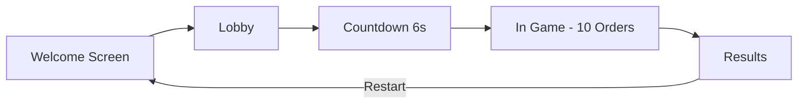

# Oh My Hungry God - Multiplayer Implementation

Complete multiplayer AR game implementation for Global Game Jam 2026.

## 🎮 What Was Built

A synchronous multiplayer system transforming the single-player AR game into a collaborative experience:

- **Authoritative .NET 9 Backend** with SignalR WebSocket communication
- **Web Host Display** showing game state on TV/projector
- **iOS AR Clients** as controllers, throwing fruits via AR

## 📦 Project Structure

The project is split across multiple repositories:

- **[GGJ2026-Backend](https://github.com/borissedov/GGJ2026-Backend)**: .NET 9 Backend
- **[GGJ2026-Frontend](https://github.com/borissedov/GGJ2026-Frontend)**: TypeScript Frontend
- **[GGJ2026-iOS](https://github.com/borissedov/GGJ2026-iOS)**: iOS ARKit App

## 🎯 How It Works

### Game Flow



### State Machine

1. **WELCOME**: Display shows logo, QR code, waiting for first player
2. **LOBBY**: Players join with names, mark ready
3. **COUNTDOWN**: All ready → 6 second countdown
4. **IN_GAME**: Always plays all 10 orders, each 10 seconds
5. **RESULTS**: Show team stars, per-player stats, with restart option

### Order Resolution (Immediate Rules)

- **Over-submission**: `submitted[fruit] > required[fruit]` → Instant fail
- **Exact match**: `submitted == required` → Instant success
- **Timeout**: Timer expires → Fail

### Mood System

- Start: NEUTRAL (😐)
- +1 mood every 2 successes → HAPPY (😊)
- -1 mood per failure → ANGRY (😠)
- Game always completes all 10 orders
- Final mood determines team stars:
  - Happy = ⭐⭐⭐ (3 stars)
  - Neutral = ⭐⭐☆ (2 stars)
  - Angry = ⭐☆☆ (1 star)

## 📡 API Reference

### SignalR Hub Methods (Client → Server)

| Method | Parameters | Description |
|--------|------------|-------------|
| `CreateRoom` | - | Display creates room, returns `{ roomId, joinCode }` |
| `JoinRoom` | `joinCode` | Player joins, returns `{ roomId, playerId }` |
| `SetReady` | `roomId, ready` | Toggle ready state |
| `ReportHit` | `roomId, hitId, fruit` | Submit fruit hit (idempotent) |
| `Ping` | `roomId` | Keep-alive |

### Server Events (Server → Clients)

| Event | Target | When |
|-------|--------|------|
| `RoomStateUpdated` | Display | Player join/leave/ready |
| `CountdownStarted` | Display | All players ready |
| `GameStarted` | Both | Countdown complete |
| `OrderStarted` | Both | New order begins |
| `OrderTotalsUpdated` | Display | Hit counted (not resolved) |
| `OrderResolved` | Both | Order success/fail |
| `MoodChanged` | Display | Mood changes |
| `GameFinished` | Both | 10 orders complete (includes player stats) |
| `StateSnapshot` | Mobile | On join/reconnect |

## 🔑 Key Features

### Backend
- ✅ Authoritative server (all validation server-side)
- ✅ SignalR for real-time WebSocket communication
- ✅ In-memory state (ConcurrentDictionary for thread-safety)
- ✅ Idempotent hit processing (prevents duplicates)
- ✅ Per-player statistics tracking (hit counts and percentages)
- ✅ Player name support throughout all events
- ✅ Background timers for countdown/order timeouts
- ✅ Automatic room cleanup
- ✅ 6-second countdown before game starts

### Frontend
- ✅ Logo branding on loading and welcome screens
- ✅ About link to Global Game Jam
- ✅ QR code generation for easy joining
- ✅ Real-time lobby with player names and ready states
- ✅ 6-second countdown with improved contrast
- ✅ Circular arc timer for visual countdown
- ✅ Particle splash effects on fruit hits
- ✅ Emoji highlight animations
- ✅ Mood video background system with smooth transitions
- ✅ Results screen with:
  - Team stars (0-3) based on final mood
  - Per-player statistics table
  - Restart button
- ✅ Mood-based ending videos (victory, defeat, neutral, angry)

### iOS
- ✅ SignalR client integration with player names
- ✅ Welcome screen with How To Play guide
- ✅ Share button for host URL
- ✅ About screen with GGJ information
- ✅ Lobby UI with player name display
- ✅ Order overlay in AR view
- ✅ Sound effects (touch, throw, hit, miss)
- ✅ Randomized fruit panel for each order
- ✅ Screen frame overlay with decorative border
- ✅ Hit reporting to server
- ✅ Restart functionality
- ✅ Game over overlay with results

## 🛠️ Configuration

### Backend Settings

Hardcoded in `RoomService.cs` and `GameEngineService.cs`:
- Orders per game: 10
- Order duration: 10 seconds
- Countdown duration: 6 seconds
- Results timeout: 30 seconds
- Room inactivity timeout: 5 minutes

### Frontend Settings

`.env`:
```
VITE_BACKEND_URL=http://localhost:5000/gamehub
```

For production:
```
VITE_BACKEND_URL=https://ohmyhungrygod-backend.azurewebsites.net/gamehub
```

**Required Assets:**
- `public/assets/images/logo-small.png`
- `public/assets/images/logo-large.png`
- `public/assets/videos/endings/neutral_ending.webm`
- `public/assets/videos/endings/angry_ending.webm`

### iOS Settings

**Backend URL** in `SignalRClient.swift`:
```swift
init(hubUrl: String = "https://ohmyhungrygod-backend.azurewebsites.net/gamehub")
```

**Required Assets:**
- `Assets.xcassets/Logo.imageset/` - Logo for About screen
- `Assets.xcassets/ScreenFrame.imageset/` - Leaves border overlay
- `Sounds/touch.mp3` - Touch sound effect
- `Sounds/throw.mp3` - Throw sound effect
- `Sounds/hit.mp3` - Hit sound effect
- `Sounds/miss.mp3` - Miss sound effect

## 📝 Implementation Notes

### What's Complete

✅ **Backend**: Full implementation with player names and per-player stats
✅ **Frontend**: Complete with enhanced UI, particle effects, and team ratings
✅ **iOS**: Full integration with sounds, visual enhancements, and restart

### Recent Enhancements (v2)

**Backend:**
- Player names required on join
- Per-player hit tracking and statistics
- Removed burnout game over (always complete 10 orders)
- 6-second countdown duration

**Frontend:**
- Logo branding throughout
- Circular arc countdown timer
- Particle splash effects on hits
- Emoji highlight animations
- Mood-based ending videos
- Team stars rating system
- Per-player statistics display
- Restart functionality

**iOS:**
- How To Play guide on welcome
- Share host URL button
- Sound effects system
- Randomized fruit panel
- Screen frame overlay
- About screen
- Restart option

## 📚 Documentation

- **[ARCHITECTURE.md](ARCHITECTURE.md)** - High-level architectural overview and infrastructure details
- **[Backend](https://github.com/borissedov/GGJ2026-Backend/blob/main/README.md)**: See repo README
- **[Frontend](https://github.com/borissedov/GGJ2026-Frontend/blob/main/README.md)**: See repo README
- **[iOS](https://github.com/borissedov/GGJ2026-iOS/blob/main/README.md)**: See repo README

## 🎓 Architecture Decisions

### Why SignalR?
- Built-in reconnection handling
- Automatic fallback (WebSockets → Server-Sent Events → Long Polling)
- Strong typing with C#
- Good iOS client library available

### Why Authoritative Server?
- Prevents cheating
- Consistent game state across all clients
- Simplified client logic
- Easier to debug

### Why In-Memory State?
- Fast access (no DB overhead)
- Simple to implement
- Sufficient for game jam scope
- Rooms are temporary anyway

### Why Vanilla TypeScript Frontend?
- No framework overhead
- Faster load times
- Simpler to understand
- Easier to customize

## 🚧 Future Enhancements

Not implemented but could be added:

- [ ] Player authentication
- [ ] Room persistence (Redis/Database)
- [ ] Replay system
- [ ] Leaderboards
- [ ] Sound effects
- [ ] Animations for order success/fail
- [ ] Multiple game modes
- [ ] Difficulty settings
- [ ] Room capacity limits

## 🙏 Credits

Created for Global Game Jam 2026

Technologies used:
- .NET 9 + ASP.NET Core
- SignalR
- TypeScript + Vite
- Swift + ARKit
- RealityKit
